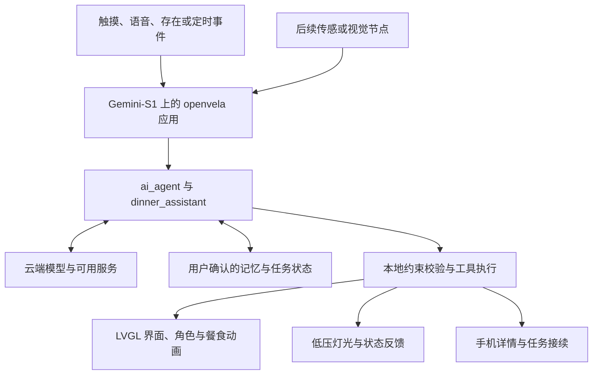

# 画间 Living Canvas

**可交互的家居艺术装置**

画间 Living Canvas 由 **星光引力 Starlight Gravity（上海星光引力数字科技有限公司）**发起。项目将实体绘画、局部动态屏幕、原创角色与设备端 AI Agent 结合，构建一个持续生活的画中家：平时可以观看角色的日常，需要时通过触摸或语音，让它帮忙安排晚餐、陪伴用餐，并逐步接入宠物快报与家庭生活服务。

**第一条要验证的完整体验是：选好一顿饭，一起吃，再让下一次选择更省事。**

中文工作名由早期的“活画”更新为“画间”，英文保留 Living Canvas。项目按长期产品持续探索，当前以 **2026 首届 openvela AI 硬件开发者大赛**作为原型验证与展示的阶段节点。

> **更新于 2026-09-13。当前处于产品定义与原型验证阶段。** 本文根据九月商业计划书更新定位与路线；现有材料支持 Gemini-S1 到货及前期准备记录，尚不足以确认完整应用通过实机验收。以下体验、架构和商业模式均为规划，具体进展见「当前进度」。

## 为什么从一顿饭开始

一顿晚饭前后有一串相连的小决定：今天做不做饭、吃什么、预算多少、哪些口味要避开，以及吃过之后是否愿意再选。独自用餐时，有人也希望能聊几句，或者有一段安静的陪伴。

画间希望把选餐、用餐和反馈连成一次自然的体验。角色使用用户确认的偏好，给出可执行的建议；餐食确认后，画中朋友端上同类食物；饭后只记录用户愿意留下的反馈，供下一次选择使用。

我们优先验证的用户是：**经常自己安排晚餐、重视居家审美、愿意尝试角色互动的成年人**。小家庭的共同选餐，以及养宠家庭的宠物快报，也是后续验证场景。性别与养宠都不是使用前提。

艺术形态是否值得长期摆放、服务是否比原有方式省事、角色是否让人愿意再次互动，需要分别通过真实试用验证。

## 一个家庭夜晚的目标体验

1. **平时看画。** 两位朋友在画中读书、整理餐桌或安静生活；指针挂钟、温湿度与天气窗提供适量信息。
2. **商量晚餐。** 触摸餐盘或说出意愿，系统结合当天预算、时间、人数、明确忌口与已确认偏好，给出一个主推荐和简短理由。
3. **作出选择。** 可以接受、换一个，或进入食物盲盒。选定后在画中查看结果，按需扫码到手机继续查看详情或制作步骤。
4. **一起吃饭。** 沿用刚才确认的餐食记录，角色端上对应类别的食物；可以聊家常，也可以选择“安静陪我”或直接结束。
5. **留下反馈。** 由用户确认实际吃过什么、是否喜欢，再决定是否保存；宠物服务成熟后，还可回看当天有来源的真实事件。

以上是一条产品体验路线，各环节按开发优先级逐步验收。语音、二维码和同餐动画等增强项尚待验证，演示时只展示实际完成的部分。

### 食物盲盒

首版可先验证四个编号盒子：先按预算与明确饮食限制筛选，再随机分配候选。触摸盒子或说“第二个”应指向同一批结果，揭晓后仍可更换或拒绝。盲盒选择不会自动付款；没有真实商家数据时，只呈现餐食建议和对应详情。

### 同餐陪伴

“吃同一顿饭”指餐食类型与用餐状态对应。例如，用户确认麻辣烫后，角色也准备一碗麻辣烫。它由已确认的餐食记录驱动，首版计划使用可复用的本地动画与餐食模板，无需通过摄像头识别每一口动作。

## 五位朋友与画中生活

当前角色方案建议 **美短猫与比格犬常住**，小猪、鸽子和外星人按故事来访。通常由两位交流，保留一个来客位置；最终名字、形象和声音仍待制作与验证。

| 角色 | 性格与日常 | 服务视角 |
| --- | --- | --- |
| 美短猫 | 细心、有小讲究，喜欢整理食谱 | 已确认的偏好、反馈与记忆 |
| 比格犬 | 热情可靠，积极张罗餐桌 | 当天预算、时间、人数与执行 |
| 小猪 | 松弛讲究的美食家，愿意分享 | 食材、菜谱与口感 |
| 鸽子 | 淡定、慢半拍，观察准确 | 生活观察、天气、提醒与宠物快报 |
| 外星人 | 好奇地球，喜欢尝新，愿意承认不懂 | 探索型推荐与食物盲盒 |

角色以成年人熟悉的日常语气交流，幽默来自自己的小习惯。用户可以跳过对话、降低声音、打断或静音，服务不会以完成养成任务为前提。

画中的生活也可以独立发生：出门、带西瓜回来、摆盘、吃水果、收拾。计划通过预制素材与状态调度延续人物和道具，让用户发起任务时能中断剧情，结束后合理继续。**角色的虚构生活、真实用户记录和真实宠物事件分别保存。**

五位角色共享经过校验的事实与决策结果，角色数量不等于需要同时运行五个独立 Agent。

## 实体绘画怎样承载交互

主体仍是实体画作与可维护画框，以壁挂为主要形态，桌面摆放作为后续选项。局部屏幕、导电触摸、灯光与声音融入构图，手机承接录入、远程回看和交易接续。

| 画中对象 | 目标用途 |
| --- | --- |
| 餐盘与餐桌 | 启动选餐、显示推荐、确认结果与同餐画面 |
| 灯 | 触摸或语音控制画中真实灯光，后续探索授权家居联动 |
| 指针挂钟 | 根据设备时间与校时结果显示时间 |
| 温湿度计与天气窗 | 呈现带来源与更新时间的室内读数、室外天气与日夜变化 |
| 冰箱 | 查看用户已录入并确认的食材，提供日期提醒与用料建议 |
| 角色与装饰 | 展示日常、来访故事、季节内容与触摸彩蛋 |

这些对象需要按实际屏幕可视区安排，不能默认一块局部屏幕覆盖整幅画。画框挂高后，坐着用餐应能通过语音或手机接续；文字、声音和触点会按实际距离测试。

早期方案曾按灯、猫、餐盘设计三个触摸区。新版参赛核心目标先保证至少两个可辨认的实体触摸区，最终位置与映射随样片和画面布局确定。

## 技术路线

当前主控基线保留 **润芯微 Gemini-S1（全志 R528）**，计划采用 **openvela、LVGL 与 ai_agent**，优先验证 **Xiaomi MiMo** 的实际调用。语音识别、语音合成、视觉与外部服务分别接入和验收。

下图为目标架构：



- **设备端**负责交互状态、运行时 Skill、动作校验、显示和灯光工具，以及退出与故障恢复。
- **云端**负责语言理解、推荐生成及后续视觉摘要，返回可校验的结构化结果。
- **角色呈现层**复用同一份推荐、记忆与状态，按顺序播放气泡、声音和动作。
- **手机与扩展节点**承接录入、远程查看和授权协同，按具体接口逐项验证。

运行时 `dinner_assistant` 计划覆盖触发、条件收集、推荐、更换、确认和记录。存在或定时事件需经过时段、冷却、当前会话和提醒开关判断，再由 Agent 调用工具执行。

设计上，本地触摸反馈、关灯、退出和已保存内容不等待云端；网络或模型失败时明确显示状态。设备时间与传感读数使用真实来源，过期或缺失数据不当作实时信息。

## 首版范围与后续路线

优先级表示计划顺序，不表示功能已经完成。

| 阶段 | 计划范围 | 进入下一阶段的依据 |
| --- | --- | --- |
| **P0 参赛核心** | 板端晚餐 Skill、真实模型请求、约束筛选、推荐与确认；至少两个实体触摸区、真实灯光、主动执行；确认记忆与断网降级 | 实机能够重复完成任务、退出并恢复，保留真实记录 |
| **P1 增强** | 优先验证语音、猫狗短讨论与一种同餐模板；按条件增加挂钟、温湿度、盲盒、二维码与天气；择优验证宠物单事件或官方健康回放 | 核心稳定后逐项验证，注明实机、回放或模拟 |
| **家庭试用与产品化** | 持续角色日常、一位剧情来客、有限宠物日记；后续跨家庭做客、内容包及服务订阅 | 真实复用、付费意愿、每户成本、安装与维护记录 |
| **后续扩展** | 自有衣橱与出门准备、授权家居联动、平台比价及交易协作 | 需求、数据、接口与交付能力分别成立 |
| **独立研究方向** | 照护、热成像及机构空间 | 单独验证硬件、场景、可靠性与服务流程 |

**宠物快报**是第二条候选服务线：从真实事件图片或短片生成带时间与来源的摘要，支持回看原始依据。单事件原型不会被写成全天监测，未观察到的行为保持未知。

**跨家庭做客**属于后续产品方向：通过双方确认的限时邀请，让一位角色参与另一家庭的聚餐协商，只共享当次允许使用的条件。剧情角色来访与现实朋友做客使用不同的会话和时间规则。

记忆与授权的产品设计包括查看、纠正、删除和控制共享；稳定偏好与当天意愿分开保存。推荐选定、扫码打开、订单确认与实际吃过也分别记录，避免一次点击产生错误记忆。

## 当前进度

九月商业计划书扩展了产品定义与经营路径，未提供新增实机测试结果、付费订单或品牌合作证明。最近一次可核对的硬件准备记录截至 **2026-09-10**。

| 方面 | 现有材料支持的状态 |
| --- | --- |
| 产品与角色 | 已形成“画间”定位、五位好友方向与分阶段路线；不代表角色素材或功能已交付 |
| 主控选型 | 由原拟 BES2800BP 调整为 Gemini-S1，开发板已到货 |
| 前期设备观察 | 历史记录显示出厂界面可运行、USB 曾枚举 NuttX Debug Bridge；不能据此认定自定义应用已完成 |
| 工程与外设 | 完整构建、板端访问、网络、音频、Skill、触摸、灯光及记忆仍需最新实机证据 |
| 用户与商业 | 付费需求、长期使用、量产成本、品牌与平台合作尚待验证 |

下一步仍从设备、工具链和官方基线开始，再实现晚餐任务、实体触摸、灯光、记忆与异常恢复。猫狗对话、同餐和其他增强项按实际集成结果加入。源码版本、构建命令、接线、日志与测试结果将随实现补齐。

## 商业模式与合作方向

商业计划先验证完整装置的交付，再验证持续服务与内容是否值得付费：

- **艺术装置**：实体画作、电子结构、基础展示与交互服务。
- **可选在线服务**：持续语音陪伴、记忆和后续宠物记录，按明确服务范围与用量设计。
- **原创内容**：房间主题、角色外观、季节场景、餐食模板和来访故事。
- **后续合作**：品牌生活短剧、交易佣金、IP 授权与机构空间服务，按真实合同、交付与结算开展。

这些是待验证的经营方向，目前不构成已上线的订阅、报价或收入。产品方案保留基础本地展示与已购内容，避免用角色责备或消失推动续费；商业内容拟提供明确标识与关闭选项，用户的私密记忆不用于隐藏广告定向。

项目希望对接嵌入式与音频工程、可维护画框与小批制造、原创内容制作及家庭试用资源。

## 与 openvela、小米及本仓库的关系

画间由星光引力独立开发，当前与小米相关的联系是 openvela 赛事和技术路线，以及拟验证的 MiMo 服务。仓库名称中的 `xiaomi` 不表示小米或米家官方产品、已签约合作或已完成生态认证。米家设备联动、产品接入与商业合作按具体授权和接口另行推进。

本仓库 [`abbyxu123/xiaomi-Living-Canvas`](https://github.com/abbyxu123/xiaomi-Living-Canvas) 用于项目介绍、资料整理与展示，当前包含：

- `README.md`：项目定位、体验、技术路线和阶段进度。
- [作品提交模板](./2026%20%E9%A6%96%E5%B1%8A%20openvela%20AI%20%E7%A1%AC%E4%BB%B6%E5%BC%80%E5%8F%91%E8%80%85%E5%A4%A7%E8%B5%9B%20-%20%E4%BD%9C%E5%93%81%E6%8F%90%E4%BA%A4%E6%A8%A1%E6%9D%BF.docx)：原有赛事材料模板，尚未填写项目成果。

正式队伍仓为 [`open-vela/contest2026_482_xingguangyinli`](https://github.com/open-vela/contest2026_482_xingguangyinli)，工程基线为 `dev-ai-contest-2026`。本仓库的文档更新不代替正式参赛提交。设备运行时 Skill、开发过程中沉淀的开发 Skill，以及真实 AI Coding 日志，是不同的交付物。

### 阅读与参与

```bash
git clone https://github.com/abbyxu123/xiaomi-Living-Canvas.git
cd xiaomi-Living-Canvas
```

当前仓库尚无可直接运行的应用入口。后续将补充经过实机验证的构建说明、BOM、接线图、测试报告与演示；现阶段可围绕官方基线、触摸样片、角色素材或用户体验提出建议。

## 参考资料

- [openvela 官方文档](https://github.com/open-vela/docs)
- [Gemini-S1 板级说明](https://github.com/open-vela/vendor_allwinnertech/blob/dev-ai-contest-2026/boards/r528/r528s3-gemini-s1/README_zh-cn.md)
- [Gemini-S1 AI 配置参考](https://github.com/open-vela/packages_ai_agent/blob/dev-ai-contest-2026/defconfigs/gemini-s1/README.md)
- [本队官方参赛仓库](https://github.com/open-vela/contest2026_482_xingguangyinli)
