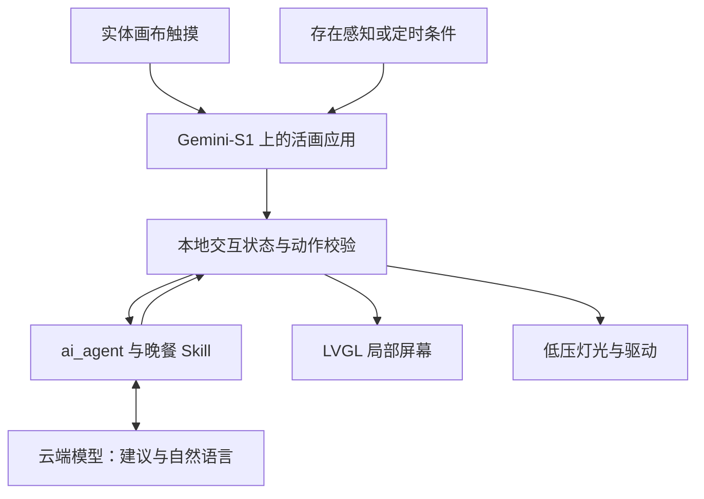

# Living Canvas｜活画

**一幅可以触摸、回应，并参与日常生活的实体绘画。**

Living Canvas（活画）是一个结合绘画、嵌入式硬件与 AI 的交互艺术项目，为 **2026 首届 openvela AI 硬件开发者大赛**筹备。我们希望把触摸区域、局部屏幕和灯光融入一幅真实的画，让观众通过画中的物件发起交互，再由画面中的显示和光线回应。

第一个要做通的生活场景是：**今天晚饭吃什么？**

> **当前阶段：原型准备与技术验证。** 本文于 2026-09-11 整理；硬件与开发进度依据截至 2026-09-10 的项目记录。开发板已到货并能显示出厂界面，活画应用尚未完成板端验证。下文的交互流程和系统架构是目标设计，已确认的进展见「当前进度」。

## 为什么做这个项目

活画希望探索一个问题：当绘画拥有感知和回应的能力，它能怎样参与人的日常生活？

我们的构想是让真实绘画承载交互。画中的灯、猫和餐盘既是画面的一部分，也可以成为触摸入口；一块嵌入局部的小屏幕负责显示会变化的内容，灯光则让反馈延伸到实体画面。绘画本身仍然是作品的主体。

晚餐被选为第一个场景，因为它能把这种交互落到一件具体的小事上。用户可以表达「想自己做」或「今天不想做饭」，获得少量建议，再确认、换一个或结束。这个场景也让我们能够完整验证：一次触摸如何变成请求，AI 如何给出建议，以及建议如何回到画面和实物反馈中。

我们希望形成的体验是：平时是一幅画，需要时可以轻轻触碰，让它帮忙做一个日常决定。

## 画中的交互如何发生

以下是第一版计划采用的触摸映射，导电触摸和外设接线仍待实测。

| 画面元素 | 计划承担的交互 |
| --- | --- |
| 灯 | 本地开灯、关灯 |
| 猫 | 切换选项、换一个建议 |
| 餐盘边缘 | 开始晚餐交互、确认选择 |
| 局部屏幕 | 显示选项、请求状态与建议，提供退出、设置和清除记录入口 |

一次完整的晚餐体验计划如下：

1. 用户触摸餐盘开始；主动提示则只在用户已启用的晚餐时段内，由存在事件或定时条件触发，并设置冷却时间。
2. 用户选择「自己做」或「不想做饭」，按需补充偏好。
3. 板端 AI Agent 根据明确输入请求少量建议；预算、食材和忌口等未知信息不作假设。
4. 建议显示在餐盘对应的屏幕区域，灯光提供相应反馈。
5. 用户触摸猫换一个建议，触摸餐盘确认，也可以随时退出。

关灯和退出由本地逻辑处理，不等待云端响应。断网或请求失败时，应显示状态并允许结束交互。存在感知与语音仍是体验目标，需要分别验证硬件和服务链路后接入。

## 系统准备怎样实现

下面展示的是目标架构，尚不代表各模块已经联通。



| 部分 | 选定方向与职责 |
| --- | --- |
| 主控 | 润芯微 **Gemini-S1**，全志 **R528** 平台 |
| 系统 | **openvela**，围绕赛事分支 `dev-ai-contest-2026` 验证官方基线 |
| 图形 | **LVGL**，用于局部屏幕界面、状态与建议展示 |
| AI 编排 | 板端 **ai_agent**，计划接入自定义晚餐运行时 Skill |
| 模型服务 | 计划验证 **MiMo**；实际接口权限与调用尚未验证 |
| 实体输入与输出 | 画布导电触摸、低压灯光；控制模块、引脚、电平与驱动待核验 |
| 后续接入 | 存在传感器、触摸开始录音、语音识别与播报，分别验证后接入 |

端云分工的原则是：云端负责建议和自然语言，本地负责交互状态、动作校验、退出、关灯及故障降级。模型通过受限工具影响显示和灯光，硬件动作由本地逻辑校验后执行。

计划中的 `dinner_assistant` 是设备运行时的晚餐 Skill。开发过程中沉淀的可复用开发 Skill，以及 AI Coding 日志，是另外两类交付物，需要分别保留真实使用记录。

## 项目是怎样走到现在的

最初的产品构想已经包含实体绘画、导电触摸、晚餐场景、灯光与局部显示。之后的工作主要围绕开发板选型、开发环境和参赛交付方式展开。

| 阶段 | 已记录的变化 |
| --- | --- |
| 最初方案 | 计划使用 BES2800BP，探索绘画与 AI 硬件结合的实现方式 |
| 2026-09-08 | 根据工作人员推荐，确认改用 Gemini-S1；软件主线选择 openvela、LVGL 和 ai_agent |
| 2026-09-09 | Gemini-S1 到货，开始检查实物与连接条件 |
| 2026-09-10 | 整理实机记录：出厂界面可显示，USB 曾枚举 NuttX Debug Bridge；形成分阶段开发路线 |
| 2026-09-11 | 整理本 README，建立项目背景、目标体验与实际进度的统一入口 |

换板时尚无已验证的 BES 板端活画应用，因此这一调整主要影响后续工具链、显示、音频和外设适配。实体绘画与晚餐交互的方向延续保留。

Gemini-S1 的官方资料提供了显示、AI 和音频相关参考，我们选择先从官方基线逐项验证。实物的屏幕型号、分辨率和触摸驱动仍需核对，不能仅凭开发板名称套用配置。

## 当前进度

截至上述记录时间，项目已完成方向选择和部分准备，尚无可复现运行的活画版本。

| 项目 | 已确认 | 下一步 |
| --- | --- | --- |
| 产品方案 | 实体绘画、晚餐场景及首版触摸映射已形成草案 | 用实物样片验证触摸与画面布局 |
| 开发板 | Gemini-S1 V1.1 已到货，出厂界面可显示 | 核对固件、屏幕、触摸及恢复方式 |
| USB 连接 | 曾成功枚举 NuttX Debug Bridge | 安装并验证 ADB，取得真实板端只读返回 |
| 开发环境 | UTM 已安装，Ubuntu 镜像已校验 | 完成系统安装，验证主机架构与工具链兼容性 |
| 工程与应用 | 尚未同步完整 openvela 工程，未完成构建或板端应用验证 | 构建并运行官方最小基线 |
| AI 与音频 | 已确定参考路线 | 验证真实模型请求，以及录放音和语音服务 |
| 画布与外设 | 触摸和灯光方向已确定，配件清单与具体型号仍待核验 | 补齐 BOM、接线和真实联动测试 |

USB 枚举成功只说明数据连接有了初步证据；板端访问、固件备份和部署仍未验证。出厂界面也不计作活画应用的实现成果。

## 接下来的开发顺序

1. **确认设备基线**：读取板端信息，核对屏幕与固件，明确恢复方式。
2. **准备可复现的工作区**：验证工具链，同步官方工程，固定源码版本，验证 AI Coding 日志采集。
3. **跑通官方基线**：依次检查启动、显示、触摸、联网、真实 AI 请求及录放音。
4. **实现晚餐交互**：完成选择、请求、推荐、确认、取消和超时处理，接入运行时 Skill 与主动提示。
5. **接入实体作品**：先验证一个触摸电极，再扩展到三个区域，接入灯光并完成画面装配；按成熟度接入存在感知和语音。
6. **测试与交付**：记录误触、响应和异常恢复的实际结果，整理复现说明、照片、演示视频与开发记录。

本次范围聚焦一幅画和一个晚餐场景。自动下单、读取真实冰箱、多用户社交、健康诊断和定制主板量产不在当前实现范围内。

## 这个仓库放什么

本仓库 [`abbyxu123/xiaomi-Living-Canvas`](https://github.com/abbyxu123/xiaomi-Living-Canvas) 用于活画的项目介绍、资料整理与展示。当前包含本 README 和原有的[作品提交模板](./2026%20%E9%A6%96%E5%B1%8A%20openvela%20AI%20%E7%A1%AC%E4%BB%B6%E5%BC%80%E5%8F%91%E8%80%85%E5%A4%A7%E8%B5%9B%20-%20%E4%BD%9C%E5%93%81%E6%8F%90%E4%BA%A4%E6%A8%A1%E6%9D%BF.docx)。该模板尚未填写项目成果。

赛事分配的队伍仓是 [`open-vela/contest2026_482_xingguangyinli`](https://github.com/open-vela/contest2026_482_xingguangyinli)。本仓库是独立的个人项目仓，正式参赛开发计划通过官方队伍仓的 fork 和 PR 流程开展。将资料保存到本仓库，并不等于已经完成官方比赛提交。

### 如何开始了解或参与

可以先克隆本仓库阅读资料：

```bash
git clone https://github.com/abbyxu123/xiaomi-Living-Canvas.git
cd xiaomi-Living-Canvas
```

当前尚无可直接运行的应用入口，也没有经过实机验证的完整编译、接线和烧录步骤。后续会随真实实现补充构建说明、BOM、接线图、测试结果和演示材料；现阶段可从交互方案、官方基线验证或触摸样片测试参与。

## 参考资料

- [openvela 官方文档](https://github.com/open-vela/docs)
- [Gemini-S1 板级说明](https://github.com/open-vela/vendor_allwinnertech/blob/dev-ai-contest-2026/boards/r528/r528s3-gemini-s1/README_zh-cn.md)
- [Gemini-S1 AI 配置参考](https://github.com/open-vela/packages_ai_agent/blob/dev-ai-contest-2026/defconfigs/gemini-s1/README.md)
- [本队官方参赛仓库](https://github.com/open-vela/contest2026_482_xingguangyinli)

本 README 记录的是活画的项目构想与阶段进展。功能完成情况将随实机验证更新，演示、性能数据与复现步骤以实际记录为准。
